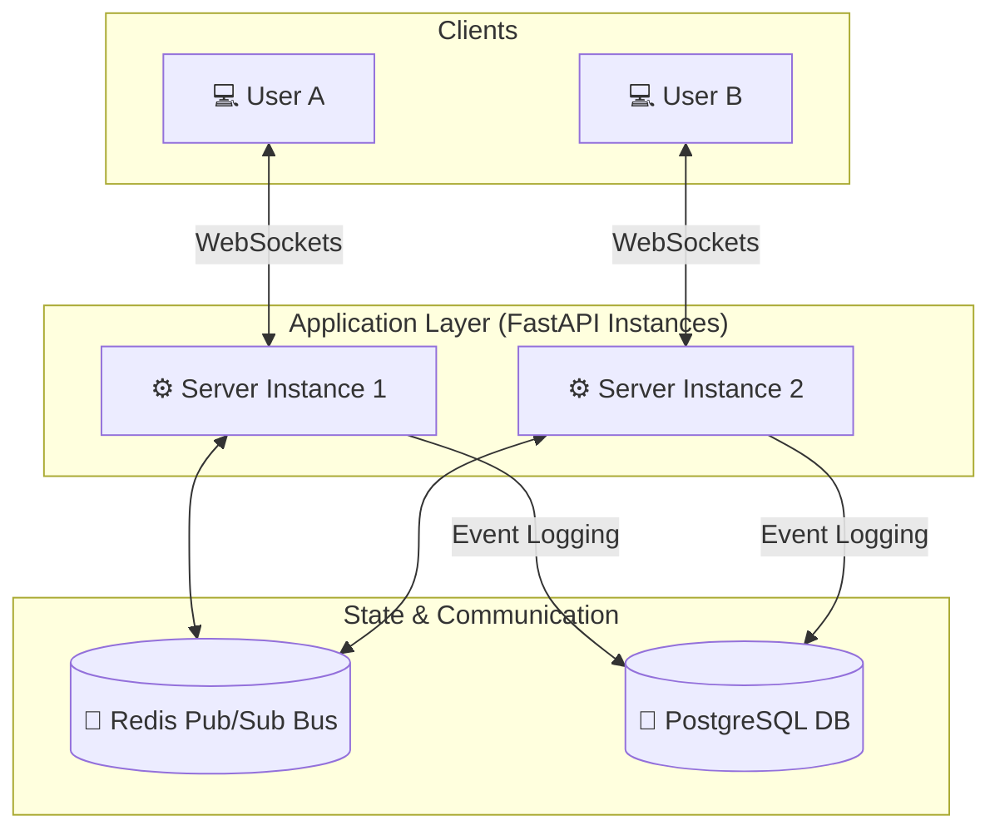
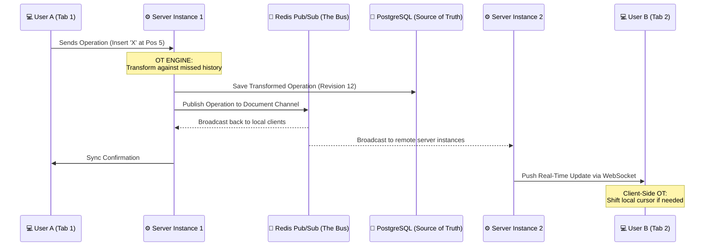

# 🚀 Real-Time Collaborative Document Editor

A distributed, production-grade collaborative editor powered by **FastAPI**, **Redis**, **PostgreSQL**, and a custom **Operational Transformation (OT)** engine.

## 🧠 The Architecture

This project uses a distributed system architecture to ensure that multiple users can edit the same document simultaneously across different server instances.



### The Operational Flow



## 🛠️ Tech Stack

- **Backend**: Python 3.10+, FastAPI (Asynchronous WebSockets)
- **Database**: PostgreSQL (SQLAlchemy ORM)
- **Message Bus**: Redis (Distributed Pub/Sub for horizontal scaling)
- **Algorithm**: Operational Transformation (Character-based conflict resolution)
- **Frontend**: Vanilla JS with Optimistic UI & Client-side Transformation

## 💎 Core Features

### 1. Distributed Operational Transformation
Most editors break when two people type at the same time. This engine calculates the "Index Shift" required to keep both users in sync, even if their messages arrive out of order.

### 2. Event Sourcing
Instead of saving document snapshots, we save every single keystroke. This allows for:
- **Infinite Undo/Redo** (Potential feature)
- **Time Travel**: Replaying the document history to any point in time.
- **Perfect Conflict Resolution**.

### 3. Horizontal Scalability
By using Redis as a message bus, you can run 100 instances of this server behind a Load Balancer, and users on Server A will see updates from users on Server B instantly.

## 🚀 Getting Started

1. **Setup Database**:
   ```bash
   # Make sure PostgreSQL and Redis are running
   alembic upgrade head
   ```

2. **Run Server**:
   ```bash
   uvicorn app.main:app --port 8000 --reload
   ```

3. **Open Client**:
   Simply open `index.html` in your browser. Open multiple tabs to see the OT magic in action!

---
*Built with ❤️ and Hard Engineering.*
